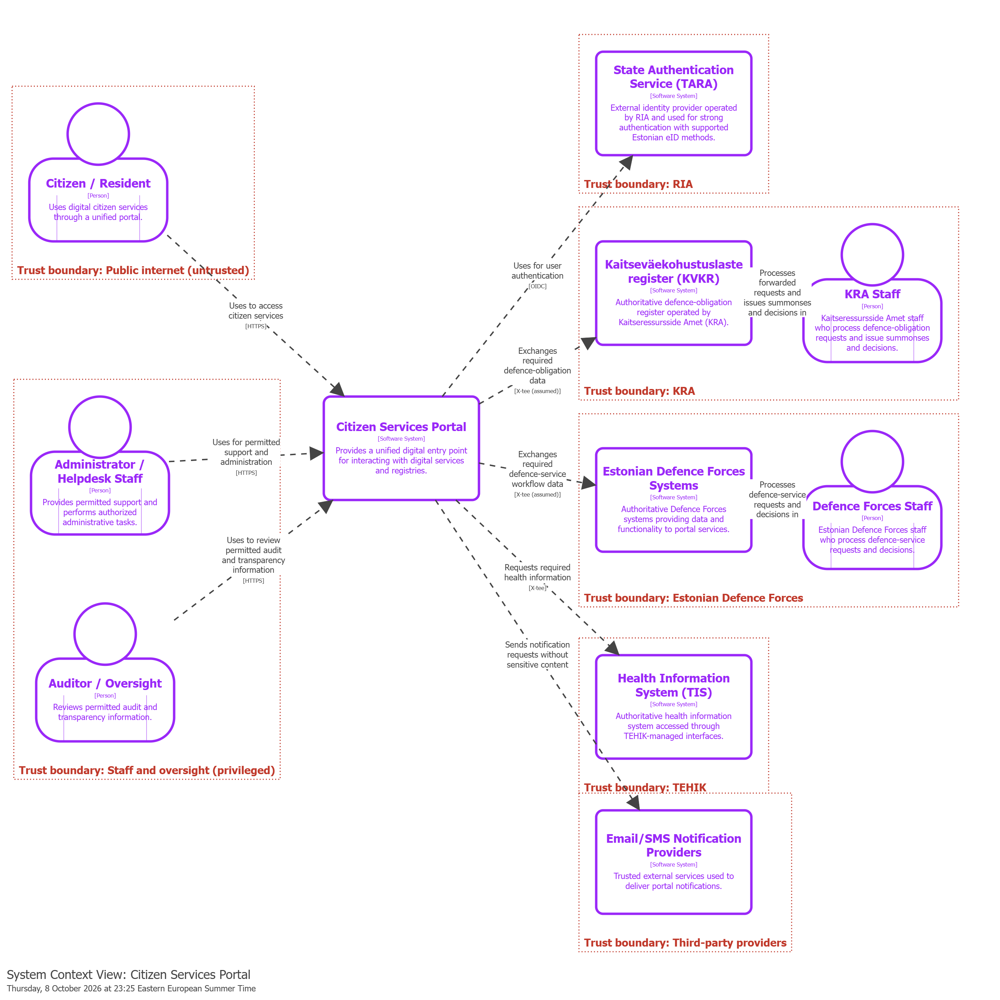
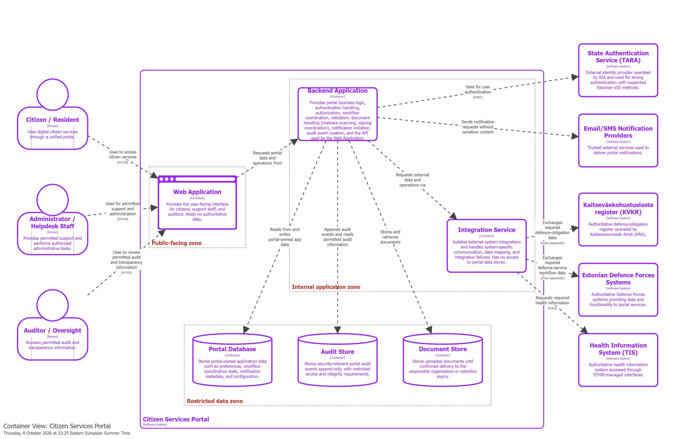

= Architecture Document
:toc:
:toclevels: 3

== 1. Executive summary

*What the system is.* The Citizen Services Portal is a single, trusted digital entry point for selected Estonian national-defence services: conscription and call-up, health assessment, and reserve service.
It lets citizens see their defence obligations, respond to summonses, submit requests and documents, and follow the status of their cases.
The portal *integrates with* the authoritative systems of the responsible organizations - Kaitseväekohustuslaste register (KVKR) operated by KRA, Estonian Defence Forces Systems, and the Health Information System (TIS) managed by TEHIK - but does not replace them.
Citizens authenticate through the State Authentication Service (TARA).

*Who it is for.* Primarily citizens and residents with defence obligations. It is also used by administrators/helpdesk staff and by auditors/oversight. KRA and the Estonian Defence Forces depend on it to receive complete, traceable requests.

*Top architectural drivers.* The five architecture-critical quality attributes are:

. *QA-001 Security & Privacy* - health and defence-related personal data must only reach authenticated and authorized users.
. *QA-002 Availability* - failure of one external system must not take down unrelated portal services.
. *QA-003 Auditability* - security-relevant actions must be traceable to the responsible user or system.
. *QA-004 Interoperability* - data must be exchanged with KVKR, Estonian Defence Forces Systems, and TIS through documented interfaces.
. *QA-007 Reliability & Fault Tolerance* - accepted citizen requests must not be lost or duplicated when an external system fails.

The resulting structure has four main characteristics:

* a thin Web Application;
* a Backend Application that enforces authorization and coordinates workflows;
* a separate Integration Service that isolates the three external systems;
* three portal-owned data stores, which hold only data the portal is authoritative for (link:../adrs/ADR-0002-data-ownership.adoc[ADR-0002]).

== 2. Architectural drivers

The full drivers are maintained in separate documents. This section summarizes them.

* link:drivers.adoc[drivers.adoc] - mission goals, stakeholders, assumptions, open questions, out of scope
* link:quality_attributes.adoc[quality_attributes.adoc] - prioritized quality attributes and trade-offs
* link:qa_scenarios.adoc[qa_scenarios.adoc] - quality attribute scenarios QAS-001 to QAS-004
* link:security_goals.adoc[security_goals.adoc] - security goals, trust boundaries, data categories, attacker assumptions
* link:../risk/risk_register.adoc[risk/risk_register.adoc] - technical risks R-001 to R-011

=== 2.1 Business goals

* Provide one trusted digital entry point for selected national-defence services.
* Protect citizens' rights and public trust when handling identity, health, and defence-related data.
* Give citizens accurate, authoritative, and up-to-date information about their obligations, requests, and decisions.
* Make conscription, health-assessment, and reserve-service workflows easier to access and complete.
* Keep citizens informed about summonses, status changes, document requests, and required actions.
* Improve cooperation between KRA, the Estonian Defence Forces, and health-information systems.
* Keep long-term operating, maintenance, and extension cost low.
* Enforce service-specific authorization and delegation rules.

=== 2.2 Quality attributes

[cols="1,2,1,1",options="header"]
|===
|ID |Quality attribute |Priority |Architecture-critical

|QA-001 |Security & Privacy |High |Yes
|QA-002 |Availability (99.9% per month target) |High |Yes
|QA-003 |Auditability (audit record within 5 s) |High |Yes
|QA-004 |Interoperability |High |Yes
|QA-007 |Reliability & Fault Tolerance |High |Yes
|QA-008 |Maintainability |High |No
|QA-010 |Regulatory Compliance |High |No
|QA-005 |Performance (95% within 2 s) |Medium |No
|QA-006 |Usability |Medium |No
|QA-009 |Transparency |Medium |No
|QA-011 |Scalability (5x normal load) |Medium |No
|QA-012 |Cost Constraints |Medium |No
|===

The main trade-offs are documented in link:quality_attributes.adoc#_trade_offs[quality_attributes.adoc]:

* security over usability and performance;
* availability balanced against cost;
* auditability balanced against privacy;
* integration isolation over raw performance.

=== 2.3 Constraints and assumptions

* Authentication uses TARA (OIDC) with supported Estonian eID methods. The portal does not implement its own identity provider.
* KVKR, TIS, and Estonian Defence Forces Systems remain authoritative for their data. The portal integrates and does not replace them.
* Machine-to-machine interfaces to the external systems are assumed to exist and be documented (unvalidated: R-002, R-003).
* Delegation rules are service-specific and may prohibit delegation for national-defence services.
* The portal runs in a government-managed cloud or data centre.
* Legal rules (obligations, retention, delegation) are given and out of scope for the architecture.

== 3. System context

Source: link:../diagrams/workspace.dsl[diagrams/workspace.dsl] (view `C4Context`).

*Question answered:* who uses the Citizen Services Portal, which external systems it depends on, and where the trust boundaries between organizations lie.

=== 3.1 Actors

[cols="1,3",options="header"]
|===
|Actor |Interaction with the portal

|Citizen / Resident
|Uses the Web Application over the public internet to view obligations, respond to summonses, submit requests and documents, and see case status and transparency information. Untrusted until authenticated through TARA.

|Administrator / Helpdesk Staff
|Uses the portal for permitted support and administration under least privilege (SG-010).

|Auditor / Oversight
|Reviews permitted audit and transparency information.

|KRA Staff / Defence Forces Staff
|Do not use the portal directly in the current design. They process requests forwarded by the portal and issue decisions in their own systems (KVKR, Estonian Defence Forces Systems). Whether they need portal access is an open question (section 11).
|===

=== 3.2 External systems

[cols="2,1,3,1",options="header"]
|===
|System |Owner |Role for the portal |Protocol

|State Authentication Service (TARA)
|RIA
|Authenticates citizens and staff with ID-card, Mobile-ID, or Smart-ID.
|OIDC

|Kaitseväekohustuslaste register (KVKR)
|KRA
|Authoritative source for defence-obligation data, call-up, and summonses; receives citizen requests.
|X-tee (assumed)

|Estonian Defence Forces Systems
|Estonian Defence Forces
|Authoritative for defence-service and reserve-service workflow data and decisions.
|X-tee (assumed)

|Health Information System (TIS)
|TEHIK
|Provides health information required for health assessment.
|X-tee

|Email/SMS Notification Providers
|Third party
|Deliver notifications. They receive only a prompt to log in, never sensitive content (SG-009).
|Provider API (TBD)
|===

=== 3.3 Trust boundaries

The diagram shows each organization as a separate trust boundary, matching link:security_goals.adoc#_trust_boundaries[security_goals.adoc]:

* *Public internet* - citizens' devices are untrusted. All access passes through authentication (SG-001) and authorization (SG-002).
* *Staff and oversight* - privileged users. Their actions are least-privilege and audited (SG-010).
* *RIA, KRA, Estonian Defence Forces, TEHIK, third-party providers* - each external organization is a separate boundary. Exchanges use authenticated channels (SG-006), and compromise of one must not grant access to unrelated data (SG-007).

== 4. Containers

Source: link:../diagrams/workspace.dsl[diagrams/workspace.dsl] (view `C4Container`).

*Question answered:* which applications and data stores make up the portal, what each is responsible for, and how they communicate with each other and with external systems.

=== 4.1 Container responsibilities

[cols="1,3,2",options="header"]
|===
|Container |Responsibility |Must not

|Web Application
|User interface for citizens, helpdesk staff, and auditors. Renders data obtained from the Backend Application and submits user actions to it.
|Hold authoritative data; make authorization decisions; call external systems directly.

|Backend Application
|Handles the OIDC flow with TARA and portal sessions, and enforces authorization and delegation rules on every request. Coordinates request workflows and their state, including idempotent submission. Validates input. Handles documents (malware scanning on upload, signing coordination). Creates audit events and triggers notifications. Exposes the API used by the Web Application.
|Talk to KVKR, TIS, or Estonian Defence Forces Systems except through the Integration Service.

|Integration Service
|Isolates each external system behind its own adapter. Handles system-specific protocols (X-tee), data mapping to portal models, timeouts, retries, and explicit "unavailable/pending" results.
|Access portal data stores; persist health information.

|Portal Database
|Portal-owned data: preferences and contact details, notification metadata, workflow coordination state for requests not yet accepted, status snapshots, authorization configuration, system configuration.
|Store replicas of KVKR, TIS, or Estonian Defence Forces data.

|Document Store
|Uploaded documents, kept until confirmed delivery to the responsible organization or retention expiry.
|Keep documents beyond their retention period.

|Audit Store
|Append-only security-relevant audit events, readable only through restricted audit and transparency functions.
|Allow modification or deletion of existing events.
|===

=== 4.2 Where the portal capabilities are handled

[cols="1,3",options="header"]
|===
|Capability |Handled in

|Identity and access control
|Backend Application, with TARA as the identity provider. Authorization and delegation checks are enforced centrally in the Backend Application; the Web Application only reflects the result. Roles and permissions are kept in the Portal Database.

|Case workflows
|Backend Application, which coordinates request state in the Portal Database. External steps run through the Integration Service. After a request is accepted by KRA or the Estonian Defence Forces, their system is authoritative and the portal keeps only a reference and status snapshot.

|Documents and signing
|Backend Application handles upload, malware scanning, and download, and stores files in the Document Store. Signing is coordinated by the Backend Application using the citizen's eID; the signing service to use is still open (section 11).

|Notifications
|Backend Application decides when to notify and records notification metadata in the Portal Database. Delivery goes through Email/SMS Notification Providers. Messages contain only a prompt to log in, never health, defence, or case details (SG-009).

|Auditing and transparency
|Backend Application creates audit events and appends them to the Audit Store. Auditors and citizens see filtered views through the Web Application (QA-009).

|External integrations
|Integration Service, with one adapter each for KVKR, Estonian Defence Forces Systems, and TIS, and contract tests per interface (QA-004, QA-008).
|===

=== 4.3 Data ownership overview

The full decision and rationale are in link:../adrs/ADR-0002-data-ownership.adoc[ADR-0002].

[cols="2,2,2",options="header"]
|===
|Data category |Authoritative owner |Where it lives in the portal

|Defence-obligation data, summonses
|KVKR (KRA)
|Fetched on demand; status snapshot only

|Defence-service workflow data, decisions
|Estonian Defence Forces Systems
|Fetched on demand; status snapshot only

|Health information
|TIS (TEHIK)
|In memory only; never persisted or logged

|Identity assertion / session
|TARA / portal
|Short-lived session in the Backend Application

|Request workflow state before acceptance
|Portal
|Portal Database

|Preferences, contact details, notification metadata, authorization configuration
|Portal
|Portal Database

|Uploaded documents
|Portal until delivery
|Document Store

|Audit records
|Portal
|Audit Store
|===

=== 4.4 How the structure addresses the drivers

[cols="2,3,2",options="header"]
|===
|Driver / scenario / goal |Design choice |Not yet validated

|QA-001, SG-001, SG-002, SG-003, QAS-002
|TARA-based authentication. Authorization is enforced centrally in the Backend Application for every request. The Web Application holds no data. External data is fetched on demand instead of copied (ADR-0002).
|The authorization and delegation model itself (R-001, planned ADR-0003); TARA behaviour (R-005).

|QA-002, QA-007, QAS-001
|The Integration Service isolates each external system and returns explicit unavailable or pending states. Workflow state and idempotency keys are kept in the Portal Database so accepted requests survive external failures.
|Whether workflows are synchronous or asynchronous; failure-injection tests (R-006).

|QA-003, SG-005, SG-010
|A separate, append-only Audit Store with restricted access. Every security-relevant action creates an audit event in the Backend Application.
|Required event set and fields (R-008); integrity protection and concentrated privilege of the Backend Application (R-011).

|QA-004, QA-008, QAS-003
|One adapter per external system in the Integration Service, with contract tests per interface version. No other container depends on external data models.
|Actual interface availability and versioning (R-002, R-003, R-007, R-010).

|SG-006, SG-007
|External exchanges go only through the Integration Service, which has no access to portal data stores. Authenticated channels are used (OIDC, X-tee).
|X-tee use for KVKR and Estonian Defence Forces Systems is assumed, not confirmed.

|SG-009
|Notifications carry no sensitive content.
|Whether this is acceptable for usability (QA-006).

|R-004, QA-010
|The portal stores only portal-owned data (ADR-0002).
|Phase 1 validation with a representative workflow; retention rules.

|QA-005, QA-011, SG-008, QAS-004
|Not yet addressed structurally.
|Workload baselines unknown (R-009); scaling and rate-limiting approach to be designed after Phase 1-2.
|===

== 5. Components

_Not due at Checkpoint 1._ Planned: component views of the Backend Application (authorization, workflow, documents, audit) and the Integration Service (per-system adapters).

== 6. Key architectural mechanisms

_Not due at Checkpoint 1._ Initial direction is given in section 4. Open points for each mechanism:

=== Identity and access

TARA OIDC flow, session handling, authorization and delegation model - see R-001, R-005, planned ADR-0003.

=== Data management

See link:../adrs/ADR-0002-data-ownership.adoc[ADR-0002]. Caching policy per external system is still open.

=== Workflow and messaging

Synchronous versus asynchronous processing of external steps, and how idempotency is implemented - see R-006.

=== Auditing and logging

Audit event catalogue, integrity protection, and separation from operational logs - see R-008, R-011.

== 7. Interfaces

_Not due at Checkpoint 1._ Link to API specifications in link:../api/[api/].

== 8. Security analysis

_Not due at Checkpoint 1._ Current inputs: link:security_goals.adoc[security_goals.adoc] and link:../risk/risk_register.adoc[risk register]. A threat model will be added later.

== 9. Deployment and operations

_Not due at Checkpoint 1._ Link to deployment, observability, and recovery notes in link:../ops/[ops/].

== 10. Evolution plan

_Not due at Checkpoint 1._ Expected changes include new external interface versions (QAS-003), onboarding additional agencies or services, and possibly splitting the Backend Application if capability boundaries are validated (ADR-0002 alternatives).

== 11. Open questions and known inconsistencies

=== Open questions

* *Agency staff access:* do KRA Staff and Defence Forces Staff need portal access, or do they work only in their own systems?
* *Signing:* which signing service should the Backend Application use (for example RIA's signature gateway, or direct eID signing libraries)? Is signing needed in the first services at all?
* *Protocols:* are KVKR and Estonian Defence Forces Systems actually reachable through X-tee? The diagrams currently mark this as assumed.
* *Workflow style:* which external steps must be synchronous, and which can be queued (QAS-001)?
* *Audit of external exchanges:* should the Integration Service write audit events directly, or report them to the Backend Application?
* *Malware scanning:* is scanning done inside the Backend Application or by a separate scanning service?
* *Workload:* what are normal and peak load (QAS-004, R-009)?
* The open questions in link:drivers.adoc#_open_questions[drivers.adoc] still apply.

=== Known inconsistencies

* *Citizen vs staff trust boundary.* link:security_goals.adoc[security_goals.adoc] lists a boundary between citizen-facing and privileged staff functionality. In the container view, both run in the same Web Application and Backend Application, so the boundary is only logical. A separate staff application is a candidate for a future ADR.
* *Availability target vs TARA dependency.* QA-002 sets a 99.9% availability target, but no citizen can log in while TARA is unavailable. The target must either exclude TARA outages or the portal must define behaviour for that case.
* *Notification providers are not behind the Integration Service.* The Backend Application calls them directly. This is deliberate, because they are delivery channels rather than authoritative registries, but it is an exception to "external systems are isolated in the Integration Service".
* *Status snapshots vs "authoritative data only".* ADR-0002 allows a minimal status snapshot for availability. Snapshot staleness must be visible to citizens so it does not contradict mission goal "accurate, authoritative, and up-to-date information".

== Appendix

* ADR index: link:../adrs/README.adoc[adrs/README.adoc]
* Glossary: link:glossary.adoc[glossary.adoc]
* Ownership sketch: link:ownership_sketch.adoc[ownership_sketch.adoc]
* Iteration plan: link:iteration_plan.adoc[iteration_plan.adoc]
